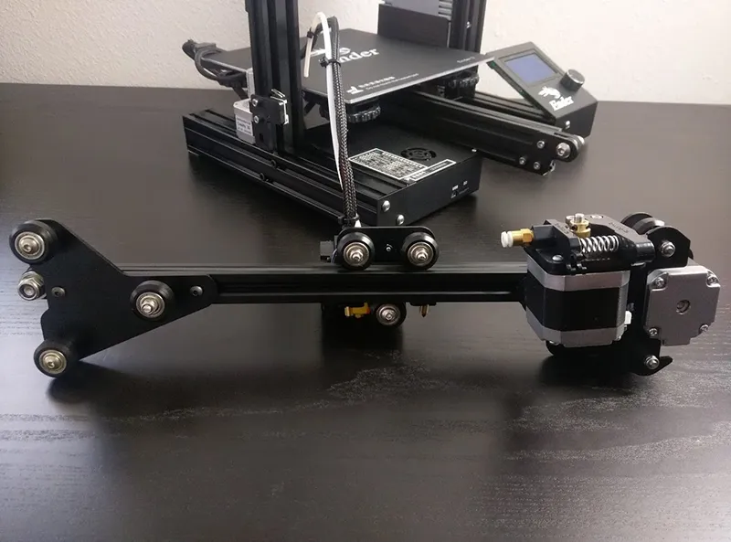

## Hardware for our inverted pendulum

Goals: 
- A traditional, multi-stage inverted pendulum (so linear?? rail, motor & controller outside the arm)
- Capable of supporting 3 stages (so 3 angle measurement points)
- Under $200
- Pretty & compact enough to be a living room decoration
- (ideally) USB-C PD (so limited to 20V 3A continuous, 5A peak)
- Able to run reinforcement learning models

Comparing mechanical architectures:
Linear

- https://hackaday.io/project/167290-open-source-inverted-pendulum
  - linear bearings are expensive 

- Ender 3
  - X axis (aluminum extrusion w/ gantry)
  - basically this assembly, but longer aluminum extrusion 

Size: 
    - approx. table underneath tv - buy alumninum extrusion slightly bigger than that - say under 48"
Buy:
    mech:
    - [x] 2020 extrusion ~1200mm 48"
    - [x] wheel gantry thing from ender (sprockets and stuff) - 
    - [x] belt loop tensioner around end thingy from ender too
    - [x] timing belt
    - [x] motor
    - motor shaft timing pulley - 3d print first

    electronics
    - [have] psu - usb c trigger board + step down to 5v
    - [have] motor driver - pwm lm smth stupid
    - [no] limit switches 
    - distance sensor
    - [have pi] raspberry pi zero ($20) or jetson orin nano super ($250)?
    - drive motor encoder (for velocity)
      = 4x https://www.adafruit.com/product/4022
      + [have] 3x magnets (have)
      + 1x diametric magnet

    - how to measure angle of legs ()
      - over bluetooth independent microcoller
      - [x] 2x slip ring
        - https://www.adafruit.com/product/775
        - amazon
        - imu
            - will work when tilt base
            - inaccurate
            - movement of the arm itself, will influence accel, therefore making calculating orientation relative to gravity hard
        - encoders
          - magnetic (ideal)
            - i2c over slip ring would be noisy
          - quadrature
            - *possibly* less noisy, but no absolute angle
        - anytihng in an easy to use package
    - RGB
    - filament